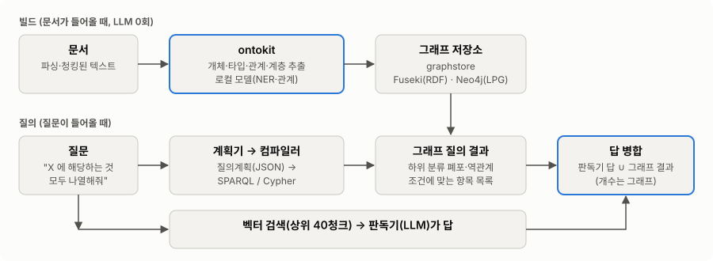
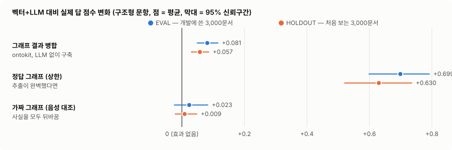
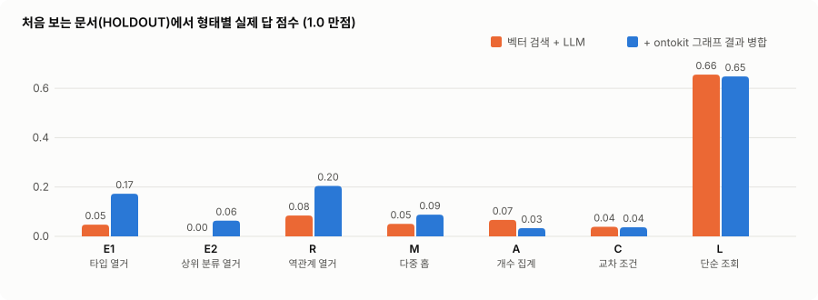
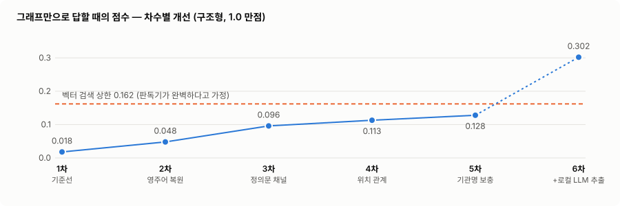

# xgen-ontokit

**한국어** · [ENGLISH](README.en.md)

**한국어 문서에서 LLM 없이 온톨로지 그래프(개체·타입·관계·계층)를 만들고, 그 그래프로 벡터 검색이 못 하는
"모두 나열해줘 · 몇 개야 · 누가 누구와" 질문의 답을 보태는 라이브러리.**

- **만든다** — 문서 청크 → 개체·타입·관계·`subClassOf` 계층. 형태소·규칙·로컬 소형 모델만 쓴다(LLM 0회, 문서 외부 유출 0, 같은 입력 → 같은 그래프).
- **싣는다** — 서버 없이 돈다(인메모리 rdflib · 내장 Oxigraph). 같은 질의가 Fuseki(RDF/SPARQL)·Neo4j(LPG/Cypher)에서도 같은 답을 낸다 — 서버는 선택이다([독립 실행](docs/STANDALONE.md)).
- **쓴다** — 질문을 그래프 질의로 바꿔 결과를 **벡터 검색 답에 병합**한다. 이것이 실제 답을 개선한 유일하게 검증된 방식이다.

---

## 한눈에 — 어떻게 쓰이나

<picture>
  <source media="(prefers-color-scheme: dark)" srcset="docs/img/pipeline-dark.svg">
  
</picture>

1. **빌드**(문서가 들어올 때): ontokit 이 개체·타입·관계·계층을 뽑아 그래프 저장소에 싣는다.
2. **질의**(질문이 들어올 때): 계획기가 질문을 질의계획으로 바꾸고, 컴파일러가 SPARQL/Cypher 로 실행한다.
   하위 분류 포함("음악가" → 가수·작곡가), 역관계, 별칭 연결을 질의 시점에 쓴다.
3. **병합**: 벡터 검색(상위 40청크)을 읽은 판독기(LLM)의 답에 그래프 결과를 합친다. 개수 질문은 그래프 개수를 쓴다.

> ⚠️ 현재 XGEN 제품은 ontokit 을 쓰지 않으며, 그래프를 "청크를 더 가져오는 데"만 쓴다(그 방식은 효과 0 으로 측정됨).
> 위 병합 경로는 **측정 하네스 안에서 검증된 상태이고 제품 반영 전**이다.

---

## 지금 수준 — 정직한 성적표

같은 질문에 **벡터 검색 + LLM** 만 쓴 답과, 거기에 **ontokit 그래프 결과를 병합**한 답을 정답과 대조해 채점했다.
개발에 쓴 문서(EVAL)와 **한 번도 보지 않은 문서(HOLDOUT)** 각 3,000건, 질문 210개.

<picture>
  <source media="(prefers-color-scheme: dark)" srcset="docs/img/effect-dark.svg">
  
</picture>

| 조건 (벡터+LLM 대비 점수 변화, 95% 신뢰구간) | EVAL | HOLDOUT (처음 보는 문서) |
|---|---|---|
| **ontokit 그래프 결과 병합** (LLM 없이 구축) | **+0.081** [+0.049, +0.115] | **+0.057** [+0.030, +0.086] |
| 정답 그래프 — 추출이 완벽했다면 (상한) | +0.699 [+0.599, +0.792] | +0.630 [+0.521, +0.736] |
| 가짜 그래프 — 사실을 모두 뒤바꿈 (음성 대조) | +0.023 [−0.024, +0.083] | +0.009 [−0.021, +0.048] |

**읽는 법** — 병합은 처음 보는 문서에서도 확실히 답을 개선한다(신뢰구간이 0 을 넘음). 가짜 그래프는 효과가 없으니 이득은
그래프의 **내용**에서 온다. 다만 효과는 작다 — 정답 그래프가 보여 주는 여지(+0.63)의 약 1/10 이다.

### 어디서 돕고, 어디서 못 돕나

<picture>
  <source media="(prefers-color-scheme: dark)" srcset="docs/img/forms-dark.svg">
  
</picture>

| 질문 형태 (HOLDOUT) | 벡터 + LLM | + ontokit 병합 | |
|---|---|---|---|
| E1 타입 열거 — "X 에 해당하는 것 모두" | 0.048 | **0.173** | 3.6배 |
| E2 상위 분류 열거 — "하위 분류 포함" | 0.000 | **0.063** | |
| R 역관계 열거 — "서울에서 태어난 인물 모두" | 0.084 | **0.204** | 2.4배 |
| M 다중 홉 — "그 인물들이 다닌 학교" | 0.051 | **0.088** | |
| A 개수 집계 — "모두 몇 개" | 0.067 | 0.033 | ❌ 개선 없음 |
| C 교차 조건 — "국적이 X 이고 직업이 Y" | 0.039 | 0.037 | ❌ 개선 없음 |
| L 단순 조회 — "X 의 출생지는" | 0.656 | 0.648 | 회귀 없음(벡터의 영역) |

### 점수가 낮은 이유

| 원인 | 근거 |
|---|---|
| 시험이 원래 어렵다 | 3,000문서 전체에서 해당 항목을 **전부, 이름까지 정확히** 맞혀야 한다. 개수는 숫자가 정확해야 1점. 벡터는 판독기가 완벽해도 타입 열거 상한이 0.25 |
| **그래프 품질이 상한을 정한다** | ontokit 의 사실 재현율 — 관계 16.7% · 타입 11.5%(정답 그래프 100%) |
| **클래스 이름이 질문과 안 맞는다** | 질문의 분류명 중 ontokit 타입 어휘에 있는 것 — 타입 열거 22/30, **상위 분류 9/30**("극작가"·"생물학자" 없음) |
| 판독기가 작다 | 로컬 8B 모델. 엉뚱한 이름·반복, 그래프가 맞힌 답도 버린다(그래서 병합이 효과를 낸다) |

전 과정·실패·정정 기록: [`harness/docs/`](harness/docs/) — 판정 요약은 [`L02_루프탈출_판정.md`](harness/docs/L02_루프탈출_판정.md).

---

## 무엇을 해 왔나 — 그래프 품질 개선 과정

그래프**만**으로 답하게 했을 때의 점수. 차수마다 가장 큰 손실 하나를 고치고 다시 쟀다(모두 사전 공시 후 측정).

<picture>
  <source media="(prefers-color-scheme: dark)" srcset="docs/img/rounds-dark.svg">
  
</picture>

| 차수 | 처치 | 점수 | 결과 |
|---|---|---|---|
| 1 | 기준선 | 0.018 | 관계 재현율 1.6% 진단 |
| 2 | 생략된 주어 복원 · 문장당 쌍 상한 | 0.048 | ✅ 유의 |
| 3 | 정의문 채널(백과체 전용) | 0.096 | ✅ 유의 |
| 4 | 위치 서술 관계 | 0.113 | ✅ 유의 |
| 5 | NER 미포착 기관명 보충 | 0.128 | ✅ 유의 — 그러나 벡터 상한(0.162) 미달 → **"LLM 없이 그래프 단독으로 이긴다"는 가설 실패** |
| 6 | + 로컬 LLM(Qwen3-8B) 추출 | 0.302 | 벡터 상한을 넘음, 단 3,000문서에 12시간·위키 오염 위험 |

→ 그래프 단독으로는 벡터를 못 이겨서, **벡터 답에 그래프 결과를 합치는 병합**으로 방향을 틀었고 그것이 검증됐다(위 성적표).

---

## 빠른 시작

```bash
pip install "xgen-ontokit[korean,ner]"                 # Kiwi 형태소 + KoELECTRA NER
pip install "xgen-ontokit[relation-encoder]"           # + 로컬 관계 인코더(선택)
```

```python
import asyncio
from ontokit import DeterministicKoreanExtractor
from ontokit.ner.koelectra import KoElectraNER

documents = {"문서.txt": [{"chunk_id": "c1", "chunk_text": "김가수는 서울에서 태어난 가수이다.", "chunk_index": 0}]}
ext = DeterministicKoreanExtractor(ner=KoElectraNER())          # LLM 0회
concepts, entities, relations, _ = asyncio.run(ext.extract(documents))
# entities → {'문서.txt': [{'entity': '김가수', 'class': '인물', 'source_chunks': ['c1'], ...},
#                          {'entity': '서울', 'class': '지역', ...}, ...]}
# concepts → classes · class_hierarchy(subClassOf) / relations → [(주어, 관계, 목적어), ...]
# 관계는 로컬 관계 인코더를 켜야 나온다: export ONTOKIT_RELATION_ENCODER_MODEL=<모델 경로>
# 모든 산출물에 source_chunks(어느 청크에서 왔나)가 붙는다
```

**그래프 → 질의 → 병합**(L02 에서 검증된 경로)도 서버·도커 없이 라이브러리로 돈다 — 상세는 [독립 실행](docs/STANDALONE.md):

```bash
pip install "xgen-ontokit[korean,ner,owl]"
ontokit build docs.jsonl -o graph.ttl            # LLM 0회. 출처 문서 포함
ontokit query graph.ttl '{"op":"list","return":"x","where":[{"t":"isa","v":"x","class":"가수"}]}'
```

`ontokit.graph`(투영) · `ontokit.query`(계획 → SPARQL, 인메모리·Oxigraph·원격) · `ontokit.merge`(판독 답에 그래프 결과 병합).
측정 하네스([`harness/`](harness/), 패키지 밖)는 이 모듈을 그대로 쓰며, 옮긴 뒤에도 L02 수치가 문항 단위로 같다
([S01](harness/docs/S01_라이브러리승격_동등성.md)). 장시간 측정은 `harness.supervise`·`harness.guard` 로 돌린다.

---

## 구성 요소와 모델

| 역할 | 무엇 | 비고 |
|---|---|---|
| 형태소·클래스·계층 | Kiwi + 규칙(접미 공유·정의문·직업 어휘집) | 모델 없음 |
| 개체 인식 | KoELECTRA-small (로컬) | 타입이 거칠다(인물·기관·지역…) |
| 관계 추출 | KLUE-RE roberta-small v13c (로컬, opt-in) | 외부 정답 F1 0.6169. large 0.6726 은 2.2배 느려 선택형 |
| 그래프 저장소 | 인메모리(rdflib) · 내장 Oxigraph — 서버 없음. 측정 당시 Fuseki · Neo4j(LPG, graphstore 경유) | 같은 질의 같은 답(문항 단위 — [S01](harness/docs/S01_라이브러리승격_동등성.md)) |
| 계획기·판독기 (측정) | Qwen3-8B 4비트, 로컬(MLX) | 외부 전송 0. 제품의 대형 LLM 보다 약하다 |
| 벡터 검색 (측정 기준선) | XGEN 제품 검색 API · text-embedding-3-small | 제품 설정 그대로 |

**기본값** — 무인자 생성은 LLM 0회·모델 로드 0회다. 모델을 쓰는 채널(NER·관계 인코더·영어)은 전부 선택형이다.
스위치 전체 표는 [채널 상세](docs/CHANNELS.md#기본값--env-스위치-한눈에).

---

## 한계와 다음 과제

**측정하지 않은 것** — 한국어 위키(백과체)만 · 판독기는 로컬 8B 만 · 정답은 Wikidata 사실(맞는 답이 오답 처리될 수 있음, 사람 감사 미실시) · 템플릿 질문.

| 우선 | 과제 | 왜 |
|---|---|---|
| 1 | 제품 RAG 경로에 "그래프 결과 병합" 반영 | 검증된 유일한 이득 경로가 아직 제품에 없다 |
| 2 | 클래스 어휘 정렬(분류 체계 가져오기 — 예: 상품 카테고리 트리) | 상위 분류 질문의 21/30 이 그래프에 없는 분류명이라 막힌다 |
| 3 | 롯데·뉴스 문서로 정답셋 | 이 결과는 백과체에서만 확인됐다 |
| 4 | 큰 판독기로 재측정 | 제품 수준에서 이득이 남는지 |
| 5 | 추출 재현율 | 관계 16.7%·타입 11.5% 가 상한을 정한다 |

---

## 더 보기

<details>
<summary><b>버전별 채널·동작 변화</b> (펼치기)</summary>

| 버전 | 변화 | 상세 |
|---|---|---|
| v0.16 | 관계 인코더 선택형 4개(생략 주어 복원·문장당 쌍 상한·위치 관계·기관명 보충), 개념 게이트 무동작 경고. **기본 동작 변화 없음** | [기본값·스위치](docs/CHANNELS.md#기본값--env-스위치-한눈에) |
| v0.15 | QDT 유령 게이트 **기본 on**(관계 없는 수량·날짜 개체 차단) | [언어 지원·동작 변화](docs/CHANNELS.md#언어-지원-매트릭스-v0160-정직하게) |
| v0.14 | 정의문 채널 **기본 off**(뉴스체 거짓률 88.5%) | [정의문 계층](docs/CHANNELS.md#정의문-계층타이핑-v012--이질계층-유도-기본-off-v014) |
| v0.13 | 관계 인코더(KLUE-RE) · 직업 타이핑(P106, 기본 on) · 영어 spaCy 관계 | [관계 인코더](docs/CHANNELS.md#관계-인코더-v013--klue-re--sredfm-ko-증강-holdout-06169-v13c) · [직업 타이핑](docs/CHANNELS.md#직업-인스턴스-타이핑-v013--p106-어휘집-기본-on) |
| v0.12 | 정의문 계층·타이핑 | [정의문 계층](docs/CHANNELS.md#정의문-계층타이핑-v012--이질계층-유도-기본-off-v014) |
| v0.10 | 동시출현 약관계 | [동시출현](docs/CHANNELS.md#동시출현-약관계-v010--llm-free-관계밀도-확충-언어무관) |
| v0.9 | 클래스 승격 필터 | [클래스 승격](docs/CHANNELS.md#클래스-승격-필터-v09--llm-free-과생성-해소) |
| v0.8 | 인용 온톨로지(`:cites`) | [인용](docs/CHANNELS.md#인용-온톨로지-v08--doc-level-cites) |

</details>

<details>
<summary><b>품질 근거 — 외부 공개 데이터로 잰 것</b> (펼치기)</summary>

| 축 | 외부 정답 | 결과 |
|---|---|---|
| 관계 | KLUE-RE 공식 validation 7,765 | micro-F1 **0.6169**(v13c) · large 0.6726 |
| 개체 정규화 | 한국어 위키 redirect | F1 0.776 — 게이트 0.80 미달로 미탑재 |
| 계층 | Wikidata P279 + 한국어 위키 | 재현 산출물 미랜딩 — 자체 심판 기록만 |

재현 방법과 "아직 근거가 약한 것": [품질 근거](docs/CHANNELS.md#품질-근거--직접-재현할-수-있는-것만)

</details>

<details>
<summary><b>코드 구조</b> (펼치기)</summary>

```
src/ontokit/
├── protocols.py          # 주입 인터페이스 (Extractor/GraphStore/VectorStore/LLM)
├── extractors/           # deterministic_ko(핵심, 한·영 이중추출) + base(merge_concepts)
│                         #   relation_ko(조사 SVO) / relation_encoder_ko(KLUE-RE, opt-in)
│                         #   relation_en(spaCy 의존 SVO, opt-in) / relation_hybrid(⚠️LLM, 주입 전용)
├── morphology/           # kiwi_nouns(한국어) + en_nouns(영어 nltk POS)
├── hierarchy/            # suffix_share(접미공유·주엔진), hearst_ko(정의문, 기본 off v0.14~)
├── instance_typing/      # occupation(P106 어휘집·기본 on) + evidence + hygiene
├── ner/                  # koelectra(ko) + english(dslim BERT) + ensemble·span_align
│                         #   word_boundary·suffix_fragment (실험 스위치, 기본 off)
├── dedup/                # deterministic(형태소) + synonym_dict(우리말샘, opt-in) + class_synonyms
├── citations.py          # doc-level :cites (v0.8)
├── filter/               # class_promotion(v0.9) · concept_gate(P279, 기본 off)
├── cooccurrence.py       # coOccursWith 동시출현 약관계 (v0.10)
└── search/               # improvements (subClassOf*, floor guard) — XGEN 전용

harness/                  # 온톨로지 하네스 — 패키지 밖(설치 안 됨). 벤치·질의·판독·채점·대조군
docs/                     # 채널 상세(CHANNELS.md), README 그림(img/, make_figures.py 로 재생성)
```

설계 원칙 — **코어 의존성 0**(모델·백엔드는 전부 extras) · **프로토콜 주입**(`Extractor`/`GraphStore`/`VectorStore`/`LLM`) ·
**단일 소스**(개선은 라이브러리 한 곳에서, 스위치로 A/B).
왜 LLM 없이 결정적으로 만드는가(감사·재현·데이터 통제·출처 추적), 입력 계약(파싱·청킹이 끝난 청크 — PDF/HWP 파싱은 하지 않음),
설치 extras 전체: [개요·설계 원칙](docs/CHANNELS.md#개요설계-원칙-구-readme-서두).

</details>

---

## 설치 · 의존성으로 추가하기

```bash
pip install xgen-ontokit                       # 코어(의존성 0)
pip install "xgen-ontokit[all]"                # 전부(Kiwi·NER·관계 인코더·영어)
pip install "git+https://github.com/Createyouracccount/xgen-ontokit.git@v0.16.0"
```

⚠️ 원격에 올라간 최신 태그는 현재 **v0.13.1** 이다(v0.14.0~v0.16.0 미푸시) — 태그가 올라가기 전에는 마지막 명령이 실패하므로
커밋 SHA 로 고정한다(`...xgen-ontokit.git@<commit>`). 기본 on 채널이 마이너 버전에서 바뀐 이력이 있어 버전 고정을 권장한다.
